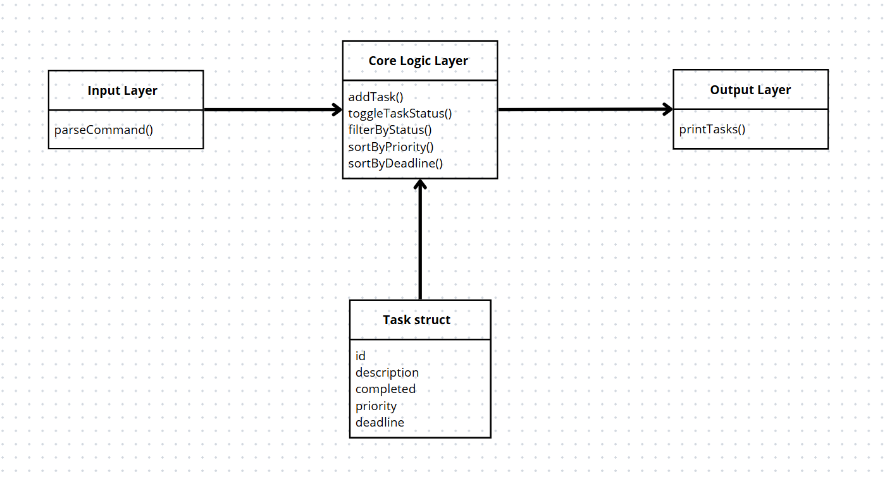

# Evidence 4 - Task APP

## Corrections
- Adding a proper diagram
- Adding a second paradigm and its time complexity

## Description
This project tackles the problem of managing the organization of tasks through a small Task application. It has been designed using the functional programming paradigm, prioritizing pure functions. The goal of the application is to allow users to create, manage, sort, and filter tasks based on attributes such as status, priority, and deadline, providing a practical tool for personal organization.

The motivation behind the project is that sometimes people forget which tasks have been completed, which ones are soon to be completed. There are already some apps that do this kind of organizatión, but this is the main base of how they work.  This project demonstrates how functional principles can support the base of these managers in maintainable code.

Functional programming is known for promoting code that is easier to test, debug, and deal with state transformations. The project involves frequent changes to task states (complete/incomplete, priority updates, reordering), which benefit from immutability and preserve previous states for undo features.

## Models
The architecture follows a functional approach. Tasks are treated as immutable data structures, and operations like adding or toggling a task generate a new copy of the task list rather than modifying the existing one.

* **Input Layer**: Handles user input, including commands like `add`, `toggle`, `filter`, `sort`, and `print`.
* **Core Logic Layer**: Processes data using functions. All operations on tasks (add, toggle, filter, sort) are stateless and return new vectors of tasks.
* **Output Layer**: Displays the list of tasks in a formatted way, reflecting the requested operation.

Data flow:


* **Immutability** ensures that all state transitions are predictable and testable.
* **First-class functions** allow operation logic to be passed as arguments.
* **Referential transparency** guarantees that functions always return the same output, simplifying testing and debugging.

## Implementation
The program was implemented in C++, a language that is useful for value semantics, higher-order functions, and algorithmic programming.

All functions return new vectors rather than altering the existing ones. For example:
* `addTask` appends a task and returns a new task list.
* `toggleTaskStatus` creates a new list with the updated task.
* `filterByStatus`, `sortByPriority`, and `sortByDeadline` all return new filtered or sorted vectors.

The code is modular, maintainable, and easily extensible, supporting future features like undo, persistence, or categories.

## Test 
Testing is part of the file ```test_task.cpp ```, which has some made tasks, and the user has the possibility to make their own, to test all the functions implemented.

* **Unit tests** for core operations: add, toggle, filter, sort.
* **Edge case tests**: e.g., toggling non-existent IDs, sorting an empty list.
* **Integration tests**: sequences of operations to simulate real use.

The output of each step is printed in a consistent format, allowing manual verification.  All expected results match actual output, demonstrating correctness. Since the state is not shared or mutated, tests are deterministic.

## Analysis
### Time Complexity:
* `addTask`: O(1) - (vector push\_back). It copies the entire tasks vector, which takes O(n) time, where n is the number of tasks.
* `toggleTaskStatus`: O(n). iteration through all tasks to find the one with the matching ID.
* `filterByStatus`: O(n). Loop through all tasks to check their completed status and build a new vector of matches.
* `sortByPriority` / `sortByDeadline`: O(n log n). Both functions copy the tasks vector, which takes O(n), and then use std::sort, which runs in O(n log n) on average

### Space Complexity
 O(n). Each function creates a new vector. Space usage is linear relative to the number of tasks. 

**Object-Oriented**: Would encapsulate tasks and lists as classes with methods; simpler for maintaining shared mutable state but harder to track changes.

## Other Solution
To use another Paradigm, I ended up using Scripting, taking into consideration an implementation using regex in Python. using the same type of functions as in the Functional Paradigm, having a very
similar structure to C++. But to have a difference, there is a new function to be implemented to `filter_by_description_regex`
These functions will help to match descriptions to the ones we want to search, adding another kind of filter to the task app. And printing the ones that fully match what we search as the user for the description.

```
import re

def filter_by_description_regex(pattern):
    regex = re.compile(pattern, re.IGNORECASE)
    return [task for task in tasks if regex.search(task["description"])]
```

This specific function will result in a time complexity of O(n*m), as a result of having two loops, the task (n) and the descriptions (m).
The rest of the functions will maintain their time complexity.

## Differences: Functional vs Scripting
Functional:
-  Immutable
-  Stateless functions
-  Deterministic 

Scripting:
-  Muteable
-  Global state functions
-  Simple state, less deterministic

This scripting version shows how simple, mutable-state programs can efficiently dynamically manage tasks. 
While the functional version emphasizes predictability and immutability, the scripting version prioritizes direct control and ease of interaction.
I think I chose better the functional for its easy debug and more straightforward functions; this is a very simple but easy to understand app for other kinds of functions; it would be needed to take actions from other paradigms
or to adapt it to the functional one. Like the new function with regex, it can be a huge if with recursion until getting the description needed.

## References
- Bird, R., & Wadler, P. (1988). Introduction to functional programming. Prentice Hall. https://www.worldcat.org/title/17480008
- IEEE Standards Board. (1990). IEEE standard glossary of software engineering terminology (IEEE Std 610.12-1990). Institute of Electrical and Electronics Engineers. https://doi.org/10.1109/IEEESTD.1990.101064
- International Organization for Standardization. (2020). ISO/IEC 14882:2020 – Programming languages – C++. ISO. https://www.iso.org/standard/79358.html
- Sedgewick, R., & Wayne, K. (2011). Algorithms (4th ed.). Addison-Wesley. https://algs4.cs.princeton.edu/home/
